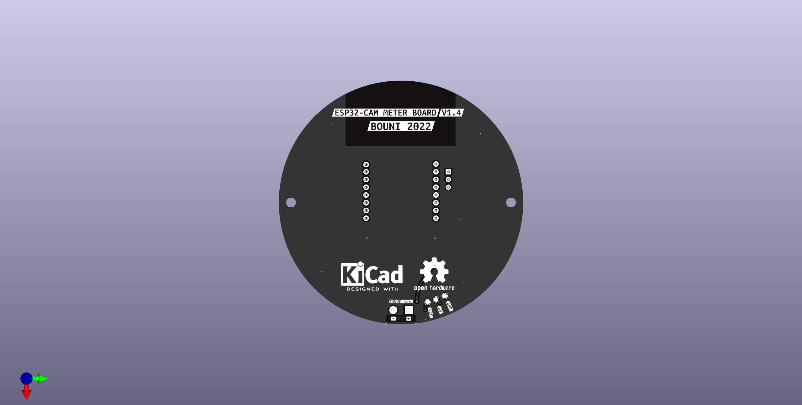

# ESP32-CAM POWER BOARD

This board is meant to act as a carrier board for an ESP32-CAM Module taht supplies it with power and allows for up to 24VDC supply voltage.

The DC-DC converter board used is of [AliExpress](https://de.aliexpress.com/item/4000186205198.html).

